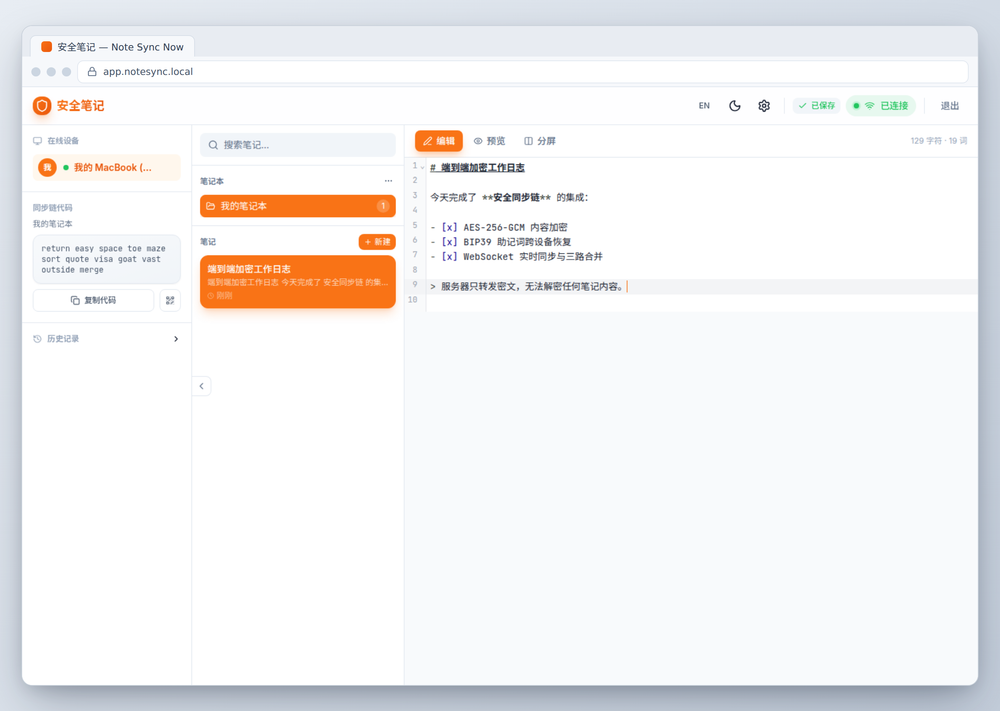

# Secure Note Chain / 安全同步笔记

端到端加密的笔记同步系统，无需账号。



## 特性

- **端到端加密**：AES-256-GCM，服务器只转发密文
- **12 词助记词恢复**：BIP39，跨设备同步密钥
- **实时同步**：WebSocket + Socket.IO，离线优先，多设备协作
- **冲突解决**：三路合并，手动解决 UI

## 快速开始

```bash
# 后端（http://localhost:3002）
cd apps/api && npm ci && npm start

# 前端（http://localhost:5173）
cd apps/web && npm ci && npm run dev
```

## 开发

```bash
npm test    # 全部测试
npm run lint
npm run build
```

架构见 [ARCHITECTURE.md](./ARCHITECTURE.md)，变更记录见 [CHANGELOG.md](./CHANGELOG.md)。

## 许可

[MIT](./LICENSE)
